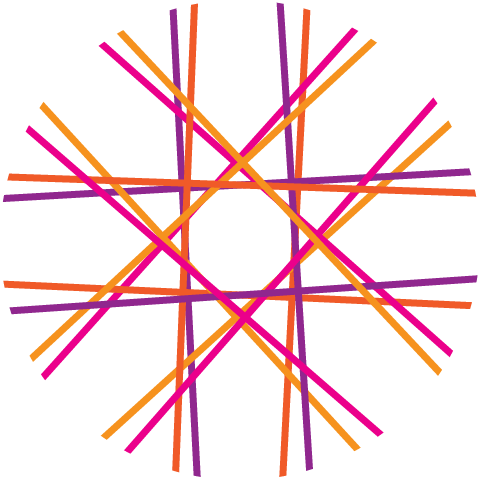

[TOC]

<h1 align="center">
  
  <div>loomjs</div>
</h1>

> A reactive components-first JavaScript framework.

## Feature Highlights

-   **Micro-updates** on rerenders - updates are made at the attribute & node-levels.
-   **Self-cleanup** leveraging native JS garbage collection & Weakmap to release dead nodes from memory.
-   **Reactivity** to rerender any number of components used within a component template.
-   **Tagged Templates** for performant processing of component templates.
-   **Client-side Routing** for dynamic rendering of components based on `Location` data.
-   **0 Dependencies** (you're welcome)
-   **Typescript Types** included.

## Install

```bash
npm i @loom-js/core -S
```

```bash
yarn add @loom-js/core
```

## Inclusion

````ts
import * as Loom from '@loom-js/core';

## Concepts

### Bootstrapping your application

The app is where you first introduce your component ecosystem (one or more components that will drive your application). Bootstrapping is the process where you create and configure your app.

**API** `init(options)`

**Inclusion** `import { init } from '@loom-js/core';`

**Arguments**

-   interface `AppInitProps` = `{ app: (ctx?: ComponentContext) => Node; onAppMounted?: (mountedApp: Node) => any; root: HTMLElement; }`

    -   `app` - A `ContextFunction` which returns a single node (the app node) that will contain all other nodes from your app's component ecosystem, and it will eventually be appended to the app's root node once the initial render is complete.

    -   `onAppMounted` - A callback function which gets called once the app node is appended to the desired DOM root node.

    -   `root` - A DOM node which the app node is appended to once the initial render is complete.

**Quick Example**

```ts
import { init } from '@loom-js/core';
import { App } from './app';
init({
    app: App(),
    onAppMounted: (app) => {
        console.log(document.contains(app));
        // => true
    }
    root: document.body
});
````

### Components

A component uses a "tagged template" (w/ [template literal](https://developer.mozilla.org/en-US/docs/Web/JavaScript/Reference/Template_literals) syntax) - the template render function - to define its template.

Use `component` to register a template render function. It takes a render function as its argument, passing Loom's template renderer to the render function along with some props, and a getter for the component's rendered node. A template context is bound to the renderer to achieve optimal rerenders.

When using `component`, the tagged template's template string must contain only one element opening & closing tag at the start & end of the template string and must belong to the same element.

**API** `component<T>(template)`

**Inclusion** `import { component } from '@loom-js/core';`

**Arguments**

-   interface `RenderFunction` = `{ (render, props) => Node }`

    -   `render` (can be named anything) - the template render function ("tagged template") with the bound context.

        -   Initializes a component template.
        -   Once initialized, it efficiently handles updates to the same component using the bound context.

        **Arguments**

        -   type `TemplateLiteral` = `` `my template literal` ``
            -   **Note** - The template literal must contain only one top-level node, of the `Element` type.

        **Returns** `Node`

    -   `props` (can be named anything or destructured) - an object literal containing dynamic property values for enriching your component, along with a getter, `node()`, which returns the component's rendered node, and two life-cycle methods: `onCreated(handler)` & `onRendered(handler)` - all life-cycle methods take a handler callback, and that handler receives the component's rendered node as an argument (see the section "Life Cycles" under "Examples" > "Components".)

**Returns** `Component` The callable component function.

**Quick Example**

```ts
import { component } from '@loom-js/core';

interface ButtonProps {
    label: string;
    type: string;
}
export const Button = component<ButtonProps>(
    (html, props) => html`
        <button type="${props.type}">${props.label}</button>
    `
);
```

### Activities (reactivity)

An activity uses a pub/sub pattern at its core. This concept directly supports reactive behavior within your component ecosystem.

When creating a new activity, you may provide a default value. One or more effects may be queued within your component ecosystem for any given activity. Then, by hooking an activity update to some event, all subscribed effects will be called in order of "first-in, first-out".

**API** `activity<T>(initialValue)`

**Inclusion** `import { activity } from '@loom-js/core';`

**Arguments**

-   `initialValue` - any type of value which is unchanged throughout the life of the activity.

**Returns** `{ effect: ActivityEffect<T = any>; update(newValue: T): void; value(): T; }`

-   **Interface**

    _Properties_

    -   `initialValue`
        -   Any type of value which is unchanged throughout the life of the activity.

    _Methods_

    -   `effect(({ value }) => (ctx?: ComponentContext) => Node)`
        -   An effect is called at least once per use, when it's first introducted during the component render process. Additionally, it's called once per activity update.
        -   `value` - the initial activity value, or the new value on updates.
    -   `update(newValue)`
        -   Calling this method will trigger all subscribed effects from the related activity, passing the new value to each effect.
    -   `value()`
        -   A getter which always returns the current value, which is initially `initialValue`.

**Quick Example**

```ts
import { activity } from '@loom-js/core';

const initialValue = 0;
export const buttonClickActivity = activity(initialValue);
console.log(buttonClickActivity.initialValue); /* => 0 */

console.log(buttonClickActivity.value()); /* => 0 */
buttonClickActivity.update(1);
console.log(buttonClickActivity.initialValue); /* => 0 */
console.log(buttonClickActivity.value()); /* => 1 */
```

See the Activity Example, below, for an `effect()` usage example.

### Routing

Routing is used specifically for single-page-apps (SPA). You can still set up server-side routes as you would for a multi-page app, and then let the client-side routing take over to achieve a snappy single-page-app experience. This approach would also work well when prerending a static site or JAMStack architecture.

There are two main technologies leveraged in the routing system - the activity system is at its core, and the browser's native History API allows for SPA behavior and clean URL's.

**API**

-   `router(routeConfigCallback: ActivityHandler<Location>)` - Hooks up reactivity based on `Location` data & History API updates.
    -   `routeConfigCallback`
        -   Has the following function signature: `({ value }) => ContextFunction`
        -   The value of `value` will always be the current browser's `Location` object.
        -   A `ContextFunction` must always be returned - this the value which a component returns when you call it.
-   `onRoute(event: SyntheticMouseEvent<T>, options: OnRouteOptions)` - A `MouseEventListener` to hook up as an element's click-handler.
    -   `event`
        -   must be passed to the event handler.
        -   If `onRoute` is wrapped by another acting function, then `event` will have to be passed to the `onRoute` call, manually. Example: `(e) => onRoute(e);`
    -   `options`
        -   `href?: string`
        -   `replace?: boolean` - Will set the `replaceState` flag to true so that the url will update in the browser's address bar, but it will not add an entry to the history stack.

**Inclusion** `import { router, onRoute } from '@loom-js/core';`

**Quick Example**

```ts
import { component, onRoute, router } from '@loom-js/core';

import { About, Home, NotFound } from '@app/component/pages';

export const App = component<unknown>(
    (html) => html`
        <div>
            <nav>
                <a $click="${onRoute}" href="/">Home</a> |
                <a $click="${onRoute}" href="/about">About</a>
            </nav>
            <main>
                ${router(({ value: { pathname } }) => {
                    switch (pathname) {
                        case '/':
                            return Home();
                        case '/about':
                            return About();
                        default:
                            return NotFound();
                    }
                })}
            </main>
        </div>
    `
);
```

## Examples

### App Initialization (bootstrapping the app)

```ts
import { init } from '@loom-js/core';

import content from './content.json';
import { Page } from './page';

const rootNode = document.querySelector('#page-content');
init({
    app: Page(content),
    onAppMounted: () => {
        /*
        Used for manual trigger of `PrerenderSsgWebpackPlugin` static-site-generation.
        This method of prerendering is meant to be called after some async operation
        to allow for fetching content & saturating the DOM before capturing the page content.
        Here, the setTimeout is mimicking this scenario - there are other more appropriate methods
        which may used for async or syncronous rendering use cases.
        */ setTimeout(() => {
            if ((window as any).snapshot) {
                (window as any).snapshot();
            }
        }, 500);
    },
    root: rootNode
});
```

### Components

**Simple example**

```ts
import { component } from '@loom-js/core';

export const Button = component(
    (html) => html`<button type="button">Click me!</button>`
);
```

**Props & interpolation**

Props passed into a component can be accessed via the second argument of the `component`'s render function argument.
Interpolation is achieved using the JS ES6 standard [template literal](https://developer.mozilla.org/en-US/docs/Web/JavaScript/Reference/Template_literals) syntax

```ts
import { component, MouseEventListener } from '@loom-js/core';

export interface ButtonProps {
    className: string;
    label: string;
    onClick?: MouseEventListener;
    type: string;
}
export const Button = component<ButtonProps>(
    (html, { className, label, onClick, type = 'button' }) => html`
        <button $click="${onClick}" class="${className}" type="${type}">
            ${label}
        </button>
    `
);

/*
A component can be a simple function without using the framework `component` method,
and is considered as such so long as it returns a `ContextFunction`.
Since `Button` is created using the `component` method, it will return a `ContextFunction` when called.
Below, `SuperButton` will return the `ContextFunction` of the `Button` output when called - so we're good here.
*/
export const SuperButton = ({ label }: { label: string }) =>
    Button({
        className: 'super-button',
        label
    });
```

**Access the rendered component node**

```ts
import { component } from '@loom-js/core';

/*
`node` is a getter method which all components receive in the props argument,
and will return the rendered node of the component.
The component node will be undefined until the initial render is complete.
Warning: be careful when accessing the node that you're not messing with things which are expected to be intact for each rerender process,
i.e dynamic nodes or attributes within the template.
*/
export const Button = component((html, { node }) => {
    const onClick = () => console.log(document.contains(node()));
    / => true
    return html`<button $click="${onClick}" type="button">Click me!</button>`;
});
```

**Life Cycles**

```ts
import { component, LifeCycleHandler } from '@loom-js/core';

/ There are two component life-cycle methods - `onCreated` & `onRendered`.
/ Each will take life-cycle handler as its argument, and each handler will receive the rendered component node.
/ `onCreated` is called only the first time the component is rendered, firing just before `onRendered`.
/ `onRendered` is called each time the component is rerendered.
export const Button = component((html, { onCreated, onRendered }) => {
    const lifeCycleHandler: LifeCycleHandler = (node) => {
        console.log(node instanceof Node);
        // => true
        console.log(document.contains(node));
        // => false (on creation & 1st render);
        // => true (on rerenders)
    };

    onCreated(lifeCycleHandler); /* Called only once - on creation. */
    onRendered(lifeCycleHandler); /* Called on every render - onCreated will always be called first. */

    return html`<button type="button">Click me!</button>`;
});
```

**Activity example**

```ts
import { activity, component } from '@loom-js/core';

// Initialize a new activity with an initial value.
export const buttonClickActivity = activity(0);
console.log(buttonClickActivity.initialValue); // => 0

export interface BlueLabelProps {
    label: string;
}

// We'll update this label, reactively, as an effect of the activity.
export const BlueLabel = component<BlueLabelProps>(
    (html, { label }) => html`
        <span class="label blue">${ label }<span>
    `
);

export const Button = component(
    html => {
        const { effect, update, value } = buttonClickActivity;
        const onClick = () => {
            update(value() + 1);
            console.log(value()); // increments by 1 for every button click
        };

        // The effect is run immediately on first render and runs every time thereafter when the related activity is updated.
        // The effect must always return the output of a Component, which is a `ContextFunction`.
        // `value` holds the current value of the activity.
        return html`
            <button $click="${onClick}" type="button">
                ${effect(({ value }) =>
                    BlueLabel({ label: `Clicked count: ${value}` })
                )}
            </button>
        `
);
```

**Routing example**

```ts
import { component, MouseEventListener, onRoute, router } from '@loom-js/core';
import { About, Home, NotFound } from '@app/component/pages';

export const App = component<unknown>(
    (html) => html`
        <div>
            <header>
                ${/* Standard button example passing options to `onRoute` */}
                <button
                    $click="${(e) =>
                        onRoute(e, {
                            href: '/'
                        })) as MouseEventListener})}"
                    type="button"
                >
                    loomjs
                </button>
                ${/* Anchor example demonstrating the simpler `onRoute` usage */}
                <nav>
                    <a $click="${onRoute}" href="/">Home</a> |
                    <a $click="${onRoute}" href="/about">About</a>
                </nav>
            </header>
            <main>
                ${router(({ value: { pathname } }) => {
                    switch (pathname) {
                        case '/':
                            return Home();
                        case '/about':
                            return About();
                        default:
                            return NotFound();
                    }
                })}
            </main>
        </div>
    `
);

```

## Roadmap

-   **Lazy-loading Routes:** Support for lazy-loading of routes.

## Recognition

Thanks go out to Andrea Giammarchi for providing [the algorithm](https://gist.github.com/WebReflection/d3aad260ac5007344a0731e797c8b1a4) that made this solution possible. It is also at the core of [hyper(HTML)](https://github.com/WebReflection/hyperHTML), a light & fast virtual DOM alternative that Andrea created and maintains.
